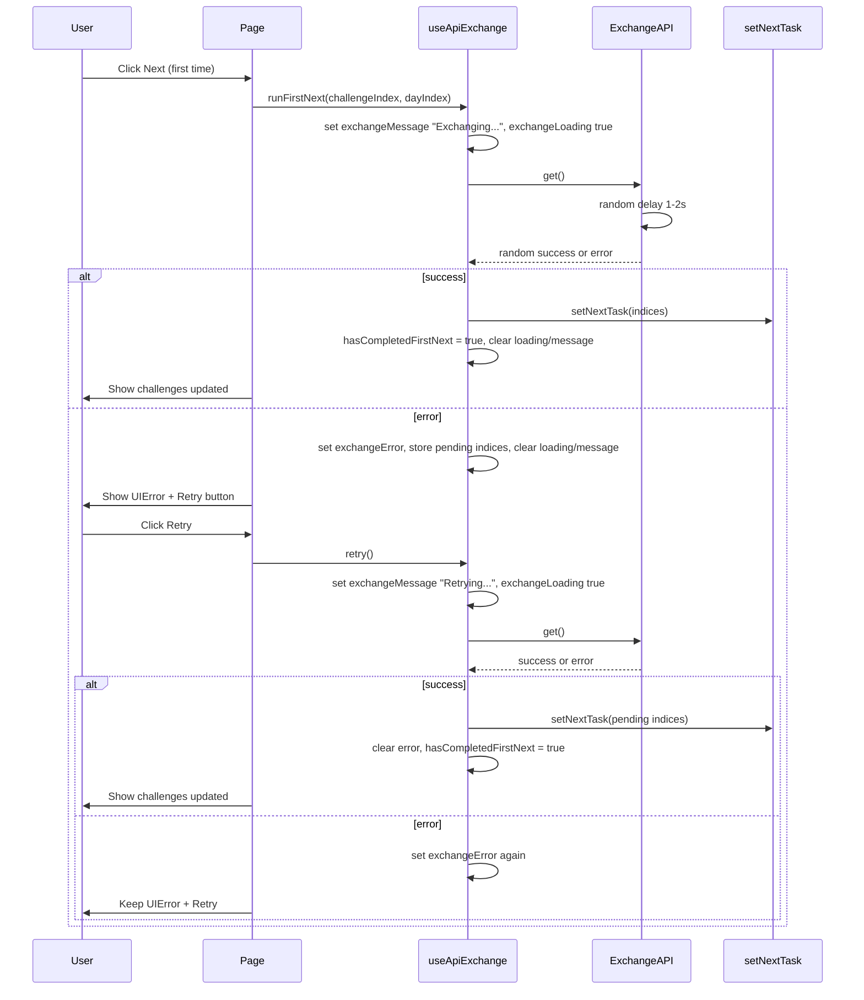

# Exchange API and first-next error handling plan

## Scope

1. Add an **exchange API** that behaves like the current fake API but **GET only**, with **random delay** and **random outcome** (success or error) so the error state can be tested.
2. Implement the first-next flow and all exchange state in a **composable** `useApiExchange(setNextTask)` so the page stays thin: when the user clicks Next the first time, the composable calls the exchange API; on success it runs `setNextTask`; on error it exposes `exchangeError` so the page can show **UIError** with a **retry button in the slot**. Retry calls the composable’s `retry()`; when it succeeds, the composable runs `setNextTask` and clears the error. **Loading and message** are handled in the composable (`exchangeLoading`, `exchangeMessage`: "Exchanging..." / "Retrying...") and shown via **UILoading** when the exchange is in progress.

## 1. Exchange API

**Location:** `services/api-exchange/index.ts` (or a dedicated route in [services/api/index.ts](src/services/api/index.ts); this plan assumes a separate module for clarity).

**Behaviour**

- **Method:** GET only. Single endpoint (e.g. `GET /api/v1/exchange` or a function `exchangeGet()` that does not take a path).
- **Random delay:** Same as main API, e.g. **1000–2000 ms** before resolving (reuse or duplicate the `randomDelay` helper).
- **Random outcome:** After the delay, return either:
  - **Success:** `{ data: null, status: 200, message: 'OK' }` (or a minimal payload), typed as `ApiResponseSuccess<T>`.
  - **Error:** `{ status: 500, message: 'Exchange failed' }` (or similar), typed as `ApiResponseError`.
- Use a random value (e.g. `Math.random() < 0.5`) to choose success vs error so both paths are testable.

**API shape (conceptual)**

```ts
get(): Promise<ApiResponseSuccess<null> | ApiResponseError>
```

**Implementation details**

- Reuse types from `@/types/api/response/*`.
- No route table needed if there is only one logical endpoint; one function that delays, then randomly returns success or error.
- Export a small client, e.g. `exchangeApi.get()`, so the composable calls it (not the page directly).

## 2. Composable: useApiExchange

**Location:** `composables/app/useApiExchange.ts`.

**Purpose:** Encapsulate all exchange-related state and logic so the page only wires the composable and template. No exchange state or API calls live on the page.

**Signature**

```ts
function useApiExchange(setNextTask: (challengeIndex: number, dayIndex: number) => void): {
  exchangeError: Ref<ApiResponseError | null>;
  exchangeLoading: Ref<boolean>;
  exchangeMessage: Ref<string>;
  hasCompletedFirstNext: Ref<boolean>;
  runFirstNext: (challengeIndex: number, dayIndex: number) => Promise<void>;
  retry: () => Promise<void>;
}
```

**State (inside composable)**

- `exchangeError` — set when the exchange GET returns an error; cleared when a new request starts or succeeds.
- `exchangeLoading` — `true` while the exchange request is in flight.
- `exchangeMessage` — user-visible message while loading: **"Exchanging..."** on first run, **"Retrying..."** when retrying after an error; cleared when the request finishes.
- `hasCompletedFirstNext` — `true` after the first exchange call succeeds; subsequent Next clicks bypass the exchange and call `setNextTask` only.
- `pendingChallengeIndex` / `pendingDayIndex` — stored when the first next fails; used by `retry()` to call `setNextTask` on success.

**Methods**

- **runFirstNext(challengeIndex, dayIndex):** If already loading, no-op. Else: set `exchangeMessage` (Exchanging… or Retrying…), clear `exchangeError`, set `exchangeLoading = true`, call `exchangeApi.get()`. On success: set `hasCompletedFirstNext = true`, call `setNextTask(challengeIndex, dayIndex)`. On error: set `exchangeError`, store indices in pending refs. In `finally`: set `exchangeLoading = false`, clear `exchangeMessage`.
- **retry():** Calls `runFirstNext(pendingChallengeIndex, pendingDayIndex)` so the same day is advanced after a successful retry.

**Dependency:** The composable receives `setNextTask` from `useChallengeProgress` (or equivalent); it does not call the progress store directly.

## 3. First-next flow (page wiring)

**Where:** [pages/index.vue](src/pages/index.vue) (home/challenges page).

**Current flow:** User clicks Next on a day → `AppChallenges` emits `onNext(challengeIndex, dayIndex)` → page `onDayNext` calls `setNextTask(challengeIndex, dayIndex)`.

**New flow (composable-based)**

- Page gets `setNextTask` from `useChallengeProgress()` and passes it to `useApiExchange(setNextTask)`.
- **onDayNext(challengeIndex, dayIndex):** If `hasCompletedFirstNext.value` then call `setNextTask(challengeIndex, dayIndex)`; else call `runFirstNext(challengeIndex, dayIndex)` (composable handles API and state).
- **UI when exchange loading:** Show **UILoading** with `:message="exchangeMessage"` so the user sees "Exchanging..." or "Retrying..." while the request runs.
- **UI when exchange error:** Show **UIError** with `:message="exchangeError.message"` and a **retry button** in the slot that calls `retry()` from the composable.
- No exchange state or API calls are defined on the page; everything comes from `useApiExchange`.

## 4. UI: UILoading and UIError with retry

**Components**

- [UILoading](src/components/ui/loading/index.vue): show when `exchangeLoading` is true, with `:message="exchangeMessage"` so the user sees "Exchanging..." or "Retrying...".
- [UIError](src/components/ui/error/index.vue): has a default `<slot />` after the message. Use it for the retry button when `exchangeError` is set.

**On the page (when exchange is loading):**

```html
<UILoading :message="exchangeMessage" />
```

**On the page (when `exchangeError` is set):**

```html
<UIError :message="exchangeError.message">
  <UIButton severity="primary" :disabled="exchangeLoading" @on-click="retry">Retry</UIButton>
</UIError>
```

`retry` is the method returned by `useApiExchange`; the composable handles calling the exchange and updating state.

## 5. Template structure (page)

- If **loading** (challenges fetch): show UILoading (e.g. "Loading challenges...").
- Else if **challenges fetch error**: show UIError (no slot).
- Else if **exchangeLoading**: show UILoading with `:message="exchangeMessage"` ("Exchanging..." or "Retrying...").
- Else if **exchangeError**: show UIError with message and retry button in slot.
- Else if **challenges.length > 0**: show AppChallenges; `onDayNext` uses composable: if `hasCompletedFirstNext` then `setNextTask` only, else `runFirstNext`.

## 6. Files to add/change

| Action | Path |
|--------|------|
| Create | `plan/api-exchange/index.md` — this plan. |
| Create | `services/api-exchange/index.ts` — GET-only exchange client with random delay and random success/error. |
| Create | `composables/app/useApiExchange.ts` — first-next state, exchange call, loading/message, retry; accepts `setNextTask`. |
| Update | `pages/index.vue` — use `useApiExchange(setNextTask)`, wire `onDayNext` and template (UILoading for exchange, UIError with retry). |

## 7. Conventions

- Reuse `ApiResponseSuccess` and `ApiResponseError`; no new types unless needed.
- Exchange service: no UI, no store; one GET that returns a typed success or error after a random delay and random outcome.
- Composable: all exchange state and logic live in `useApiExchange`; no exchange state or API calls on the page.
- Page: only composes `useChallengeProgress` and `useApiExchange`, and binds template to composable refs/methods.

## 8. Data flow (first next, then retry)



---

**Summary:** Add a GET-only exchange API with random delay and random success/error. Implement first-next flow in **useApiExchange(setNextTask)** with loading state and message ("Exchanging..." / "Retrying..."). Page uses the composable only: on first Next click call `runFirstNext`; show UILoading with `exchangeMessage` when `exchangeLoading`, and UIError with retry button when `exchangeError`; retry calls composable `retry()`. On success the composable runs `setNextTask` and clears error/loading.
