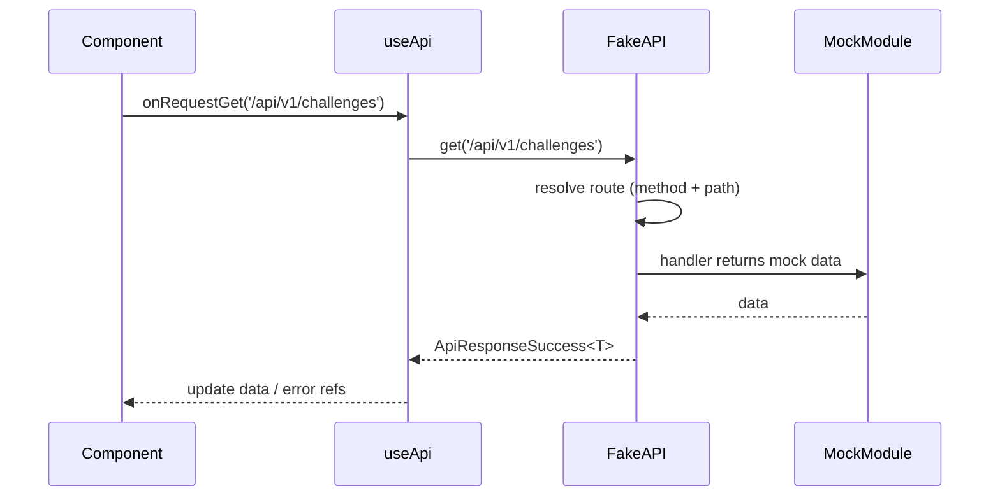

# Fake API and generic useApi plan

## Current state

- **Mock data:** [src/mock/challenges/index.ts](src/mock/challenges/index.ts) exports `{ challenges }` (array of `AppChallenge`). More mocks will be added later (e.g. `mock/users`, `mock/activities`).
- **Types:** [src/types/app/challenge/index.ts](src/types/app/challenge/index.ts), [src/types/api/response/success](src/types/api/response/success/index.ts), [src/types/api/response/error](src/types/api/response/error/index.ts).
- **Fake API** lives in `src/services/api/index.ts`; composable will be generic and path-driven.

## 1. Fake API — `services/api/index.ts`

**Responsibilities**

- Expose a small client with **GET**, **POST**, **PUT**, **DELETE**.
- Each method: **path** (string) + optional **params** (GET/DELETE) or **body** (POST/PUT).
- **No real HTTP:** resolve requests via an internal **route table** that maps `method + path` to a handler. The handler returns data from the corresponding mock (or a function that returns mock data).

**Proposed API shape**

```ts
get<T>(path: string, params?: Record<string, string | number>): Promise<ApiResponseSuccess<T> | ApiResponseError>
post<T>(path: string, body?: unknown): Promise<ApiResponseSuccess<T> | ApiResponseError>
put<T>(path: string, body?: unknown): Promise<ApiResponseSuccess<T> | ApiResponseError>
delete<T>(path: string, params?: Record<string, string | number>): Promise<ApiResponseSuccess<T> | ApiResponseError>
```

**Route resolution (URL → mock)**

- **Convention:** URL path determines which mock module is used. Example: `/api/v1/challenges` → data from `@/mock/challenges`; later `/api/v1/users` → `@/mock/users`, etc.
- Keep a **registry:** key = `"METHOD /path"` (e.g. `"GET /api/v1/challenges"`), value = handler that returns the mock data (e.g. `() => challenges` from `@/mock/challenges`).
- When adding new mocked resources: I will add a new entry in the route table that imports and returns the new mock. Optionally, you can later introduce a convention (e.g. path segment `challenges` → `mock/challenges`) to reduce boilerplate.
- Success: return `{ data, status: 200, message: 'OK' }` (`ApiResponseSuccess<T>`). Unknown route or thrown error: return `ApiResponseError` (e.g. 404 / 500).

**Implementation details**

- One file: [services/api/index.ts](src/services/api/index.ts).
- Use existing types: `ApiResponseSuccess<T>`, `ApiResponseError` from `@/types/api/response/*`.
- Handlers can statically import mock data (e.g. `import { challenges } from '@/mock/challenges'`) and return it for the matching path.

**Request delay (simulated loading)**

- Every request runs after a **random delay** so callers see real loading behaviour (e.g. `loading` state in `useApi`).
- Delay range: **1000 ms – 2000 ms** per request (inclusive). Implement with a small helper (e.g. `randomDelay(minMs, maxMs)`) that returns a `Promise` resolving after a random number of milliseconds, and `await` it at the start of the request pipeline before resolving the route or returning 404/500.
- This makes the fake API feel like a real network and ensures loading/error UIs are exercised.

## 2. Generic composable — `useApi`

**Location:** `composables/api/useApi.ts`.

**Purpose:** One generic composable to perform fake API requests by path. Caller passes the URL (e.g. `/api/v1/challenges`); the composable calls the fake API and exposes reactive state and request methods.

**Proposed API shape**

```ts
useApi<T>(): {
  data: Ref<T | null>;
  loading: Ref<boolean>;
  error: Ref<ApiResponseError | null>;
  refresh: () => Promise<void>;
  onRequestGet: (path: string, params?: Record<string, string | number>) => Promise<void>;
  onRequestPost: (path: string, body?: unknown) => Promise<void>;
  onRequestPut: (path: string, body?: unknown) => Promise<void>;
  onRequestDelete: (path: string, params?: Record<string, string | number>) => Promise<void>;
}
```

**Behavior**

- **data:** holds the last successful response payload (typed with generic `T`). Caller is responsible for using the right type when calling `onRequestGet` etc. (e.g. `useApi<AppChallenge[]>().onRequestGet('/api/v1/challenges')`).
- **loading:** `true` while a request is in progress.
- **error:** set when the fake API returns an error (e.g. 404/500); cleared when a request is started.
- **refresh:** re-runs the last request (same method, path, and params/body). Used for refetching after the initial load. If no request has been made yet, `refresh` is a no-op or does nothing.
- **onRequestGet(path, params?):** calls `fakeApi.get<T>(path, params)`, then sets `data` or `error`, and `loading`. Stores the request so `refresh` can repeat it.
- **onRequestPost(path, body?), onRequestPut(path, body?), onRequestDelete(path, params?):** same pattern for POST, PUT, DELETE; each stores the request for `refresh`.
- All request methods are `async`; use try/catch; no direct store mutation.

**Usage example**

```ts
// In a component or another composable
const { data, loading, error, refresh, onRequestGet } = useApi<AppChallenge[]>();

onMounted(() => {
  onRequestGet('/api/v1/challenges');
});
// data.value is populated from mock/challenges (via fake API route table)

// Later: refetch the same data
await refresh();
```

**Scaling**

- To support more mocked endpoints: add new routes in `services/api/index.ts` (e.g. `GET /api/v1/users` → `@/mock/users`). The same `useApi` is used; only the path and generic type change (e.g. `useApi<User[]>().onRequestGet('/api/v1/users')`).

## 3. Data flow



## 4. Files to add/change

| Action | Path |
|--------|------|
| Create / update | `src/services/api/index.ts` — fake API + route table (GET/POST/PUT/DELETE); map paths to mocks (e.g. `/api/v1/challenges` → `mock/challenges`) |
| Create | `composables/api/useApi.ts` — generic `useApi<T>()` with `data`, `loading`, `error`, `refresh`, `onRequestGet`, `onRequestPost`, `onRequestPut`, `onRequestDelete` |

## 5. Route table (initial and scaling)

- **Initial:** `GET /api/v1/challenges` → handler that returns data from `@/mock/challenges`.
- **Later:** add one registry entry per new resource, e.g.:
  - `GET /api/v1/users` → `@/mock/users`
  - `GET /api/v1/activities` → `@/mock/activities`
  - Optional: POST/PUT/DELETE for the same paths when needed (e.g. mutate in-memory mock or return stub).

Keep URL path and mock module name aligned where possible (e.g. `/api/v1/challenges` ↔ `mock/challenges`) so the plan stays generic and easy to extend.

## 6. Conventions (from .cursorrules)

- No `any`; use generics (`useApi<T>`, `fakeApi.get<T>`) for response types.
- Services: no UI, no store mutation; return typed data only.
- Composables: orchestration only, try/catch, expose minimal refs + request methods; no direct store mutation unless via store actions.
